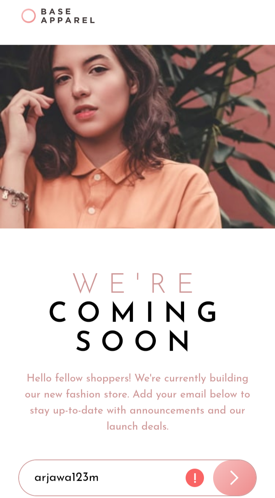

# Frontend Mentor - Base Apparel coming soon page solution

This is a solution to the [Base Apparel coming soon page challenge on Frontend Mentor](https://www.frontendmentor.io/challenges/base-apparel-coming-soon-page-5d46b47f8db8a7063f9331a0). Frontend Mentor challenges help you improve your coding skills by building realistic projects. 

## Built with

- Semantic HTML5 markup
- CSS custom properties
- Tailwindcss
- Flexbox, Grid
- Mobile-first workflow

## Demo

- Demo URL: [https://arjawa.github.io/base-apparel-coming-soon-page](https://arjawa.github.io/base-apparel-coming-soon-page)

## Screenshots

#### Desktop

#### Mobile

## Credits

- My website - [https://arjawa.tk](https://arjawa.tk)
- Frontend Mentor - [@arjawa](https://www.frontendmentor.io/profile/arjawa)
