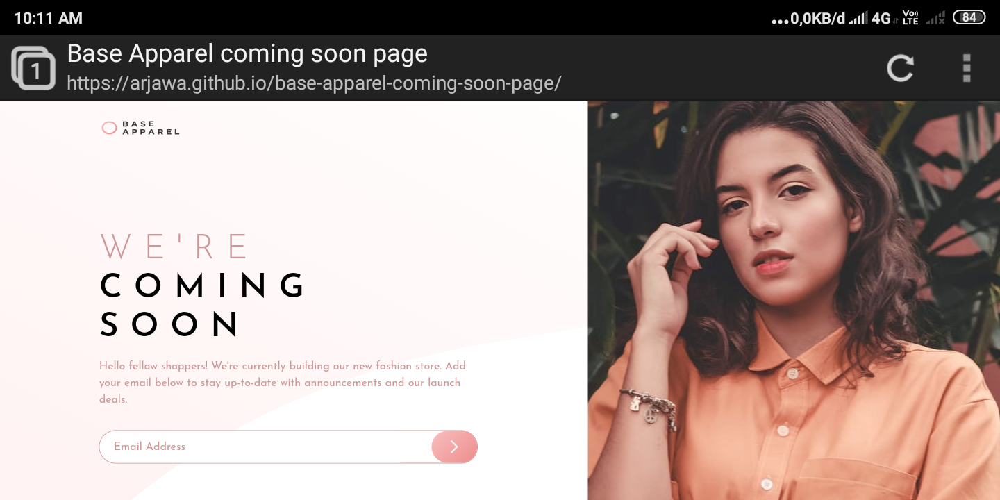

# Frontend Mentor - Base Apparel coming soon page solution

This is a solution to the [Base Apparel coming soon page challenge on Frontend Mentor](https://www.frontendmentor.io/challenges/base-apparel-coming-soon-page-5d46b47f8db8a7063f9331a0). Frontend Mentor challenges help you improve your coding skills by building realistic projects. 

## Table of contents

- [Overview](#overview)
  - [The challenge](#the-challenge)
  - [Screenshot](#screenshot)
  - [Links](#links)
- [My process](#my-process)
  - [Built with](#built-with)
  - [Useful resources](#useful-resources)
- [Author](#author)

## Overview

### The challenge

- Build out the project to the designs provided

### Screenshot

#### Desktop

#### Mobile

### Links

- Solution URL: [https://github.com/arjawa/base-apparel-coming-soon-page](https://github.com/arjawa/base-apparel-coming-soon-page)
- Live Site URL: [https://arjawa.github.io/base-apparel-coming-soon-page](https://arjawa.github.io/base-apparel-coming-soon-page)

## My process

### Built with

- Semantic HTML5 markup
- CSS custom properties
- Tailwindcss
- Flexbox, Grid
- Mobile-first workflow

### Useful resources

- [Tailwindcss](https://tailwindcss.com) - Tailwindcss framework
- [W3schools](https://w3schools.com).

## Author

- My website - [https://arjawa.tk](https://arjawa.tk)
- Frontend Mentor - [@arjawa](https://www.frontendmentor.io/profile/arjawa)
